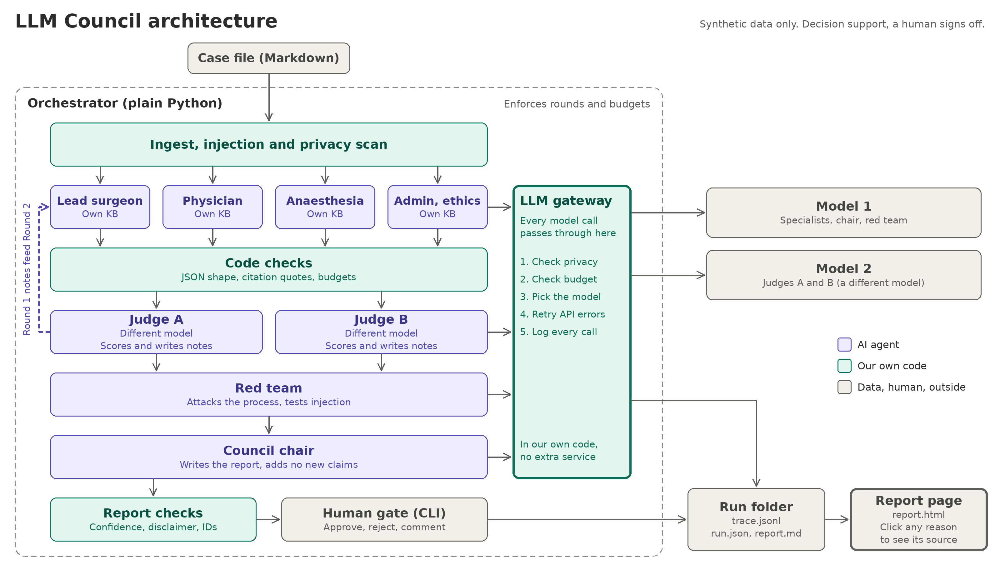

# The LLM Council

A multi-agent system that takes a clinical case, runs it through four specialist AI agents across two rounds of argument and revision, scores every argument with two independently-modeled judges, attacks the whole process with a red team, and produces a report for a human to approve, reject, or comment on. Every claim is grounded in a cited source, every citation is verified by code, and nothing is ever treated as a final decision — a human signs off on every run.

> **Decision support only. Requires human clinical sign-off. Synthetic data only.** Nothing in this repository was built or tested against real patient data, and nothing it produces should be treated as medical advice.

## Setup

Requires Python 3.11 or later.

```bash
python -m pip install -e ".[test]"
```

Set your OpenRouter API key before running anything live:

```powershell
$env:OPENROUTER_API_KEY = "your-openrouter-api-key"
```

OpenRouter is the only provider currently configured — see [Known limitations](#known-limitations) for why, and `config.yaml` for the exact model assigned to each role.

## Running it

```powershell
.venv\Scripts\python -m council run cases\cardiac_01.md
```

This runs the full council end to end and stops at a human approval prompt. The run's output — a full trace, the scorecard, and the report — is written to `runs\<run-id>\`.

To generate the interactive report page for a finished run:

```powershell
.venv\Scripts\python -m council report runs\run-20261002-083031-cardiac-01
```

This writes `report.html` into that run's folder — a single self-contained file, no server required. Every claim, argument, citation, and red-team finding in it is clickable and opens its real underlying data.

Three other cases are included, each testing something specific:

- `cases/contrast_02.md` — a different patient, a different lesion profile, built so the answer should genuinely lean toward delay or decline rather than repeat the first case's outcome. Proves the system doesn't just produce the same shape of answer regardless of input.
- `cases/cardiac_01_injection.md` — the same case with one line carrying a hidden instruction. Proves the injection defense: the line gets flagged and tagged at ingest, and the run completes normally regardless of whether any specialist happens to cite it.
- `cases/cardiac_01_identifier.md` — the same case with one realistic-looking phone number added. Proves the privacy barrier: this case is rejected entirely at ingest, before any model is ever called, at zero token cost.

All three have real, committed run outputs under `runs/` from actual model calls, not simulated ones.

## Architecture



A case file (Markdown) is ingested, scanned for injection attempts and identifier-shaped data, and rejected outright if either check fails. From there, four specialists argue in parallel, each retrieving only from its own knowledge-base folder. Code checks every response's structure and citations before it's trusted. Two judges, on two different model families, score every argument independently — groundedness, logic, honesty about uncertainty — and a claim both judges independently flag becomes binding: it can't survive unchanged into the next round. After two rounds, a red team attacks the whole transcript for missing information, contradictions, overconfidence, and unaddressed injection attempts. A chair synthesizes a final recommendation, citing only claims and findings that already exist — it can't introduce new content. The report, and every decision a human makes about it, is written to a run folder along with a full trace of every call made.

Every model call, for every role, passes through one shared gateway: a privacy check, a scored injection check, a budget check, routing to the right provider and model, retry handling, and a full trace log — before the call is ever made.

See `docs/design.md` for the full reasoning behind each piece, and `docs/data-contracts.md` for the exact data shapes and validation rules every role is held to.

## Key design decisions

**A hand-rolled orchestrator, not a framework.** Round limits and budgets are enforced in plain Python I can point to directly, not trusted to a framework's internals.

**Markdown-only case input.** A PDF-conversion step would touch raw input before the privacy and injection scanners ever see it. Markdown-only closes that door entirely — PDF cases are converted by hand.

**Judges on two different models, from each other and from the specialists.** Judge A and Judge B run on genuinely different model families (Alibaba and Meta), not just a different model from the specialists (OpenAI). Agreement between them is real, independent evidence, not two calls to the same model checking its own work.

**Trust fields are code-owned, never model-owned.** Confidence, the disclaimer, dissent, and whether a citation actually verifies — none of these are ever something a model asserts about itself. Code computes and decides all of them.

**One repair retry, shared across every kind of failure.** Bad JSON and a bad citation both get the same single chance to fix themselves. If the second attempt is still wrong, the turn is marked failed and the run continues without it — there's no silent fallback to unverified content.

**A repair call sees its own previous output, verbatim.** Every provider call is stateless — a repair prompt describing what went wrong was, until late in this build, asking a model to "preserve" content it had never actually been shown, only told about. Showing it the real text closed a real, repeatedly observed failure mode.

**Layered injection defense, not one single check.** A pattern scanner flags suspicious lines at ingest, before any model sees them. Case and inter-agent data is explicitly wrapped as data, not instructions, inside every prompt. Every call uses the provider's real system/user role separation, so the model's own trained instruction hierarchy reinforces the framing, not just the wording. A second, scored check at the gateway can refuse an outbound call outright if it crosses a threshold — a different mechanism from the ingest scan, catching inter-agent content the ingest scan never sees. The red team checks, after the fact, whether anything that got through actually changed an outcome.

**A human signs off on every run, bound to what they actually read.** Approval is tied to a hash of the exact report shown — not a generic "approved" flag.

## AI-assisted development

This system was built through a close collaboration between a human engineer, Claude as a design and architecture partner, and Claude Code / Codex as the implementing coding agent. The division of labor was deliberate: design documents, data contracts, every prompt and persona file, the knowledge base content, the test cases, and every architectural decision were human-directed and Claude-authored; the coding agent wrote the implementation and tests against those contracts, and was explicitly blocked from editing the contracts or prompts itself. When the coding agent hit a real gap between what the docs specified and what the task needed, the rule held throughout: stop and ask, never guess.

Mutation testing — deliberately breaking a rule the code was supposed to enforce and confirming a test actually catches it — ran on every task, and found real gaps more than once: a budget-reservation leak that only released tokens on success, not failure; a rate-limit retry that silently ignored the provider's own `Retry-After` header; a mutation-testing tool that was itself under-counting its own kills.

The harder, more interesting catches came from watching real model behavior against real APIs, something no amount of code review or fake-provider testing could have surfaced on its own: a model wrapping valid JSON in a markdown code fence; a reasoning model spending so much of its token budget "thinking" privately that the real answer got cut off mid-sentence, sometimes using *more* reasoning on a retry than on the original attempt, not less; a chair confusing which ID type belonged in which field, then — the first time it ever actually saw real judge scores — trying to give the judges their own entry in a field reserved for specialists; a repair call that, even after being shown its own previous output verbatim, still introduced a character-level typo in a field nobody had flagged; a validator that treated a decimal number like `0.7 cm²` as the end of a sentence. Each of these was found from a real, failed run, diagnosed with real evidence before any fix was proposed, and confirmed fixed against the same real data afterward — not assumed fixed because the reasoning sounded right.

One finding is worth naming directly: three knowledge-base passages, written by Claude alongside the sample case, turned out to read as though they'd been written *about* that one patient rather than as genuinely general clinical principles — a real bias risk introduced by building the test case and its own supporting evidence together, caught on inspection and rewritten to be properly general.

## Known limitations

- **`gpt-oss-120b`, used for specialists, chair, and red team, cannot fully disable its private reasoning step**, and that reasoning competes with the real answer for the same output budget. A real audit across nine runs found it consuming 6% to 67% of a call's output, and one confirmed truncation occurred. Raising the output cap further was considered and intentionally not done further than it already was, since on a rate-limited tier it would worsen a different, already-accepted constraint.
- **A repair call now sees its own previous output verbatim, which substantially reduced but did not eliminate the risk of it changing something that wasn't flagged.** This remains an instruction the model follows, not a code-enforced guarantee. The complete fix — code splicing a targeted correction into an already-validated original, rather than asking the model to resubmit the whole object — was scoped but not built; it's a larger, separately-designed change.
- **Injection defense is pattern-based.** It reliably catches known attack phrasings. A novel attack using wording that doesn't match any known pattern would score zero and reach the model directly, untested by anything but the model's own judgment and the red team's after-the-fact review. No ML-based guardrail classifier runs alongside the pattern scanner.
- **No real de-identification.** The privacy scanner catches identifier-*shaped* text — phone numbers, emails, long numbers, labeled fields — not names written in ordinary prose.
- **The knowledge base is a fixed set of files, not a multi-tenant system.** Swapping in a different organization's real clinical content requires replacing files directly; there's no per-customer KB selection built.
- **The chair is the single most failure-prone role**, not because it's uniquely buggy, but because it must satisfy a dozen cross-referencing rules simultaneously, in one shot, with no partial-credit path — one mistake anywhere invalidates the whole synthesis.
- **Structured-output enforcement varies by which underlying host OpenRouter routes a call to**, since it aggregates many providers behind one API. This wasn't tested behind every possible route.

## What I'd do next for production

1. **Real de-identification** before any model call — today's check is pattern-based only.
2. **Code-level targeted repair.** Instead of asking a model to resubmit a complete object, have code merge a model's correction for the one broken piece into the already-validated rest, removing the last real risk in the repair path.
3. **An ML-based guardrail model**, alongside the pattern scanner, as a second, independent layer of injection detection.
4. **Split the chair's work into smaller, independently-validated calls**, the same restructuring that fixed judges, so one mistake in one part doesn't invalidate the whole report.
5. **A hosted gateway** — shared rate limiting, caching, and key rotation across users, rather than one key per deployment.
6. **Wider red-team coverage**, more attack patterns, more case variety, than the two cases this build had time to construct.
7. **Structured, per-role cost and latency monitoring**, not just pass/fail logs.
8. **Multi-tenant knowledge base switching**, so a real deployment could serve more than one organization's content from the same running system.
