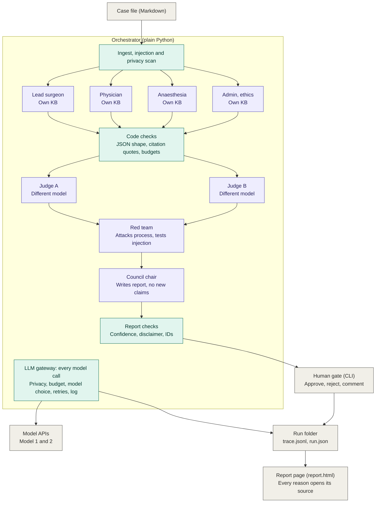

# Architecture diagram: drawing guide

Use this to draw the diagram by hand, or paste the Mermaid version at the bottom into the README, draw.io or Excalidraw.

A ready-made picture is in `architecture.png` (3200 x 1840, for slides and the README) and `architecture.svg` (editable in draw.io, Inkscape or a browser). It matches this guide and the v2.1 design.

## Colors (only three)

| Color | Meaning |
|---|---|
| Purple | AI agent |
| Teal | Our own code |
| Gray | Data, human or external |

Give a thicker border to the two boxes we want the panel to notice: **LLM gateway** and **Report page**.

## Boxes, top to bottom

**Outside, at the top**

- Case file (Markdown), gray

**One big dashed box: "Orchestrator (plain Python)"**, with the note "Rounds, budgets, retries". Inside it, in this order:

1. Ingest, injection and privacy scan (teal, full width)
2. Four specialists side by side (purple): Lead surgeon, Physician, Anaesthesia, Admin and ethics. Each says "Own KB". Add a small label "Rounds 1 and 2 (repeat)" near this row.
3. Code checks (teal, full width): JSON shape, citation quotes, budgets
4. Judge A and Judge B side by side (purple). Each says "Different model".
5. Red team (purple): attacks process, tests injection
6. Council chair (purple) next to Report checks (teal): "Writes report, no new claims" and "Confidence, disclaimer, IDs"
7. LLM gateway (teal), as a base layer at the bottom of the dashed box: "Every model call. Privacy, budget, model choice, retries, log."

**Outside, at the bottom**

- Model APIs (gray): Model 1 and 2
- Run folder (gray): trace.jsonl, run.json
- Human gate, CLI (gray): approve, reject, comment
- Report page, report.html (gray, wide): every reason opens its source

## Arrows

1. Case file to Ingest
2. Ingest to each of the four specialists
3. Each specialist to Code checks
4. Code checks to Judge A and Judge B
5. Judge A and Judge B to Red team
6. Red team to Council chair
7. Council chair to Report checks
8. Report checks to Human gate
9. LLM gateway to Model APIs
10. LLM gateway to Run folder
11. Human gate to Run folder
12. Run folder to Report page
13. Judge A and Judge B back up to the specialists row, labelled "Round 1 notes". This is the feedback into Round 2. Draw it as one arrow up the side of the dashed box, so it does not cross any other box.

Do not draw arrows from every agent to the gateway. Add this caption under the diagram instead: "Every agent call goes through the gateway."

## Mermaid version

Mermaid places the boxes automatically, so the layout will not match the drawing exactly. Treat it as a starting point. It shows the main flow only, so add arrow 13 (the judges' notes) by hand.

